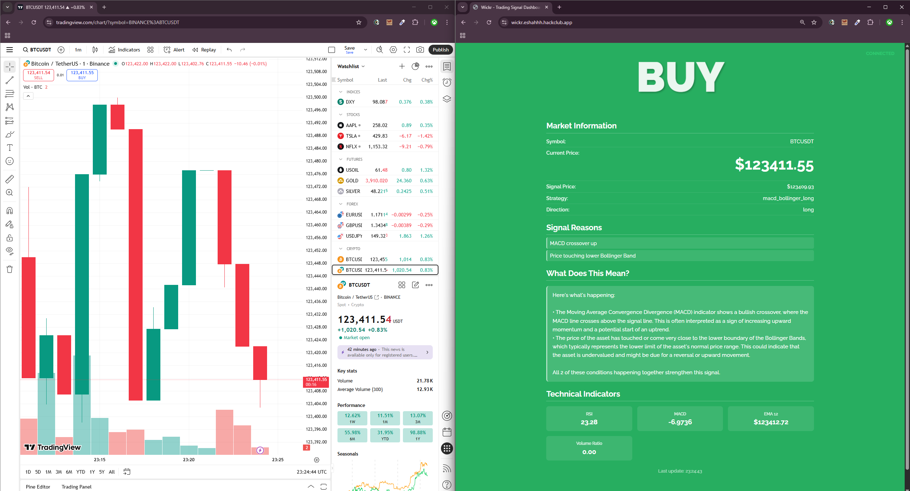
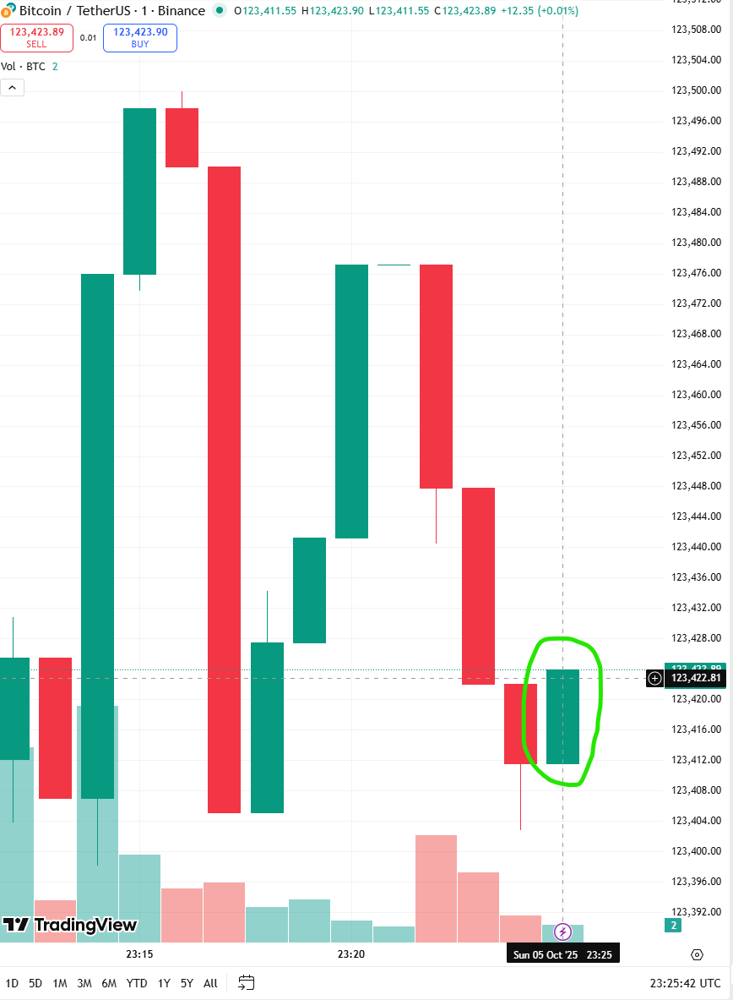

# wickr
A lightweight, real-time crypto signal generator built with Python, and powered by Binance market data.

## Short explanation
Please read the readme in [src/indicators](src/indicators/README.md) for the main detail on the algorithms I have implemented for accurate signalling. The demo website also has some layman definitions that explain what happened in short for those who dont want to readup on any of the technical jargon.

### Some demonstration
Since the algorithms themselves aren't TOO extraordinary (in simple terms, they work with averages and general market momentum), this sort of signalling will work best for small microtrading bots as compared to human traders. 

Here's a short example

You can see how working with the 1s candle data we are able to make trades on the 1m candle data and essentially **beat the competition** to the price rise/fall

This is obviously harder for a human trader to do manually because they would just be too slow. At this current stage, this is more a proof of concept and requires alot more customisation to be able to give proper accurate results and let users customise their candle windows aswell.
That said, I did try making the config.json to handle all of this in a simpler manner, I just didnt have time to allow the website to have an editor that lets you make changes to this json.

## Future plans
- [ ] Allow in-browser live editor for the json to tune parameters/switch candle sizes
- [ ] Create a proper backtesting interface that allows you to backtest your parameters on configurable time windows before you ever have to make a single real trade
- [ ] Port to pinescript for direct trading view integration? {CORS error bane of my existence! All this flask setup will be gone to waste :& }

## Important note
PLEASE ONLY USE these signals on your own accord, and especially only if you know what you are doing. The demo hosted at [wickr.eshahhh.hackclub.app](https://wickr.eshahhh.hackclub.app) has its parameters set to be more reactive and since its currently working with 1s data windows, its much more volatile. I did this only to highlight all features of the signals - or else it would just take too long to give meaningful signals for the people voting/reviewing this project

### AI Usage
I tried setting up all the websocket server and everything myself but after about 2 hours of being stuck on the same websocket issue I had to give up and ask claude for help which implemented all this autowiring socketio stuff. The main logic was all already there but I just had lots of warnings and the websocket wouldnt connect (CORS issue) and the nest setup was taking very long thats why I resorted to this.
Also some of the text and quality of life stuff and code cleanup is also AI 
